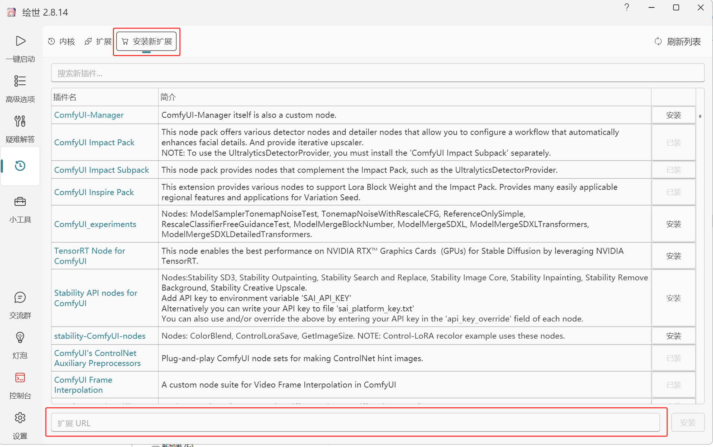

# ComfyUI-Aila-XPU

> 基于 Aila 推理引擎的 ComfyUI 插件，在 Intel Arc 显卡上实现高效的 VLM 提示词反推、LLM文本润色、ASR 语音转录、TTS 语音合成。
>
> [**English Docs**](./README_EN.md)

## 关于 [Aila 引擎 ](https://github.com/Blackwood416/Aila)

Aila 是由 [Blackwood416](https://github.com/Blackwood416) 开发的 Intel Arc 推理引擎，专为 Intel GPU（含 A770、B580 等）优化。

**核心技术栈**：
- **SYCL** —— 跨平台异构计算标准
- **oneDNN** —— Intel 深度学习加速库
- **Level Zero** —— Intel GPU 底层驱动接口
- **bitsandbytes NF4** —— 4-bit 量化支持

**原生 Intel Arc 优化**
```
Aila引擎从 kernel 层面针对 Arc 架构手写优化，实现了比 llama.cpp 等通用方案更优的推理性能。
```


感谢 Aila 作者 Blackwood416 在本插件开发过程中的快速响应！

## 简介

本插件通过 [Aila](https://github.com/Blackwood416/Aila) 推理引擎调用 **Qwen 系列模型**，在 **Intel Arc 系列显卡（含 B580）** 上提供三大功能：

- **LLM Captioner** — 图片提示词反推（SD 提示词、中文描述、Danbooru 标签），也支持纯文本问答
- **ASR Transcriber** — 语音转文字，支持短音频和长音频分段转录，可选 ForceAligner 输出 SRT 字幕
- **TTS Synthesizer** — 文字转语音，支持预设音色（CustomVoice）、语音克隆（Base）、风格指令（VoiceDesign），自动分段合成长文本

## 效果

### LLM Captioner

| 模型 | 显存占用 | 预填充速度 | 解码速度 |
|:----|:--------:|:----------:|:--------:|
| Qwen3.5-4B NF4 | ~4.5 GB | ~1050 tok/s | ~57 tok/s |
| Qwen3.5-0.8B NF4 | ~1.8 GB | ~3870 tok/s | ~144 tok/s |

### ASR Transcriber (77s 音频, Aila v0.1.4)

| 模型 | 显存占用 | 耗时 | 速度 |
|:----|:--------:|:----:|:----:|
| Qwen3-ASR-1.7B BF16 | ~7.3 GB | 19.7s | 3.9x |
| Qwen3-ASR-1.7B BNB NF4 | **~3.4 GB** | **11.4s** | **6.8x** |

### TTS Synthesizer

| 模型 | 显存占用 |
|:----|:--------:|
| Qwen3-TTS-12Hz-0.6B-Base | ~2.2 GB |
| Qwen3-TTS-12Hz-1.7B-Base | ~6.7 GB |

*以上数据基于 Intel Arc B580 12GB 实测*

## 插件安装

### 方式一：启动器安装（推荐）

打开 ComfyUI 启动器 → 插件管理 → 自定义节点 → 通过 Git URL 安装，输入：

```
https://github.com/allanmeng/ComfyUI-Aila-XPU
```


安装后还需下载运行时文件（首次安装需要）：
1. 打开 [Release 页面](https://github.com/allanmeng/ComfyUI-Aila-XPU/releases) 下载 `aila_runtime_dlls.zip`
2. 解压到 `ComfyUI/custom_nodes/ComfyUI-Aila-XPU/aila_runtime/`

### 方式二：从源码安装

```bash
cd ComfyUI/custom_nodes
git clone https://github.com/allanmeng/ComfyUI-Aila-XPU
cd ComfyUI-Aila-XPU
pip install -r requirements.txt
```

安装后同样需要下载运行时 DLL（同上，下载 `aila_runtime_dlls.zip` 解压到 `aila_runtime/`）。

### 方式三：网盘下载

[https://pan.quark.cn/s/c793f4fbb990](https://pan.quark.cn/s/c793f4fbb990)

### 目录结构（v0.1.7+）

引擎 v0.1.7 采用进程隔离架构，`AilaShared.dll` 为轻量 C API 代理，推理由独立的 `AilaWorker.exe` 执行：

```
ComfyUI-Aila-XPU/
├── AilaShared.dll              ← C API 代理（git 追踪）
├── aila_runtime/
│   ├── AilaWorker.exe           ← 推理引擎（git 追踪）
│   ├── Aila.exe                 ← CLI 工具
│   └── <oneAPI 运行时 DLLs>      ← 需下载 release zip
```

### 注意

- 插件代码通过 Git 安装，`AilaShared.dll` 和 `AilaWorker.exe` 随代码更新
- oneAPI 运行时 DLLs（~476 MB）单独从 Release 下载，仅 oneAPI 大版本升级时需更新
- 如遇启动脚本设了 `SYCL_CACHE_PERSISTENT=1`，请注释掉该变量（会导致 Aila worker 崩溃）

## 模型获取

### 支持的模型

| 模型 | 格式 | 用途 | 推荐 | 存放位置 |
|:----|:----|:----|:----:|:---------|
| Qwen3.5-4B | [NF4](https://huggingface.co/Blackwood416/Qwen3.5-4B-BNB-NF4-with-vision), [BF16](https://huggingface.co/Qwen/Qwen3.5-4B) | VLM图像反推/LLM纯文本 | **推荐 LLM (NF4)** | `models/aila/` |
| Qwen3.5-0.8B | [NF4](https://huggingface.co/Blackwood416/Qwen3.5-0.8B-BNB-NF4-with-vision), [BF16](https://huggingface.co/Qwen/Qwen3.5-0.8B) | VLM图像反推/LLM纯文本 | 轻量快速 | `models/aila/` |
| huihui-Qwen3.5-4B-abliterated | [NF4](https://huggingface.co/huihui-ai/Qwen3.5-4B-abliterated), [BF16](https://huggingface.co/huihui-ai/Qwen3.5-4B-abliterated) | VLM图像反推/LLM纯文本 | Abliterated | `models/aila/` |
| Qwen3-4B | [NF4](https://huggingface.co/Blackwood416/Qwen3-4B-BNB-NF4), [BF16](https://huggingface.co/Qwen/Qwen3-4B) | LLM 纯文本 | 纯文本推理 | `models/aila/` |
| Qwen3-0.6B | [NF4](https://huggingface.co/Blackwood416/Qwen3-0.6B-BNB-NF4), [BF16](https://huggingface.co/Qwen/Qwen3-0.6B) | LLM 纯文本 | 纯文本测试 | `models/aila/` |
| Qwen3-ASR-1.7B | [NF4](https://huggingface.co/Blackwood416/Qwen3-ASR-1.7B-BNB-NF4), [BF16](https://huggingface.co/Qwen/Qwen3-ASR-1.7B) | ASR 语音转录 | **推荐 ASR (NF4)** | `models/aila/asr/` |
| Qwen3-ASR-0.6B | [NF4](https://huggingface.co/Blackwood416/Qwen3-ASR-0.6B-BNB-NF4), [BF16](https://huggingface.co/Qwen/Qwen3-ASR-0.6B) | ASR 语音转录 | 轻量快速 | `models/aila/asr/` |
| Qwen3-ForceAligner-0.6B | [NF4](https://huggingface.co/Blackwood416/Qwen3-ForceAligner-0.6B-BNB-NF4) | ASR 强制对齐 | 字幕对齐 | `models/aila/asr/` |
| Qwen3-TTS-12Hz-1.7B-Base | [BF16](https://huggingface.co/Qwen/Qwen3-TTS-12Hz-1.7B-Base) | TTS 语音合成/音色克隆 | 质量更好 | `models/aila/tts/` |
| Qwen3-TTS-12Hz-0.6B-Base | [BF16](https://huggingface.co/Qwen/Qwen3-TTS-12Hz-0.6B-Base) | TTS 语音合成/音色克隆 | 轻量快速 | `models/aila/tts/` |
| Qwen3-TTS-12Hz-1.7B-CustomVoice | [BF16](https://huggingface.co/Qwen/Qwen3-TTS-12Hz-1.7B-CustomVoice) | TTS 预设音色 | 9种预设音色 | `models/aila/tts/` |
| Qwen3-TTS-12Hz-0.6B-CustomVoice | [BF16](https://huggingface.co/Qwen/Qwen3-TTS-12Hz-0.6B-CustomVoice) | TTS 预设音色(CustomVoice) | 轻量+预设音色 | `models/aila/tts/` |
| Qwen3-TTS-12Hz-1.7B-VoiceDesign | [BF16](https://huggingface.co/Qwen/Qwen3-TTS-12Hz-1.7B-VoiceDesign) | TTS 风格设计(VoiceDesign) | 文字描述生成音色 | `models/aila/tts/` |

### 下载模型

**推荐：直接下载已导出的 NF4 模型（即下即用，无需导出）：**

- [Blackwood416 的 HF 收藏集](https://huggingface.co/collections/Blackwood416/ailas-model-collections) — LLM + ASR NF4 模型
- [夸克网盘](https://pan.quark.cn/s/5d795bb3c417) — 基础模型包（部分推荐的模型）

**或使用导出工具自行导出：**

```bash
# LLM 模型
python export_model.py --from-hf Blackwood416/Qwen3.5-4B-BNB-NF4-with-vision
python export_model.py --from-hf Blackwood416/Qwen3.5-0.8B-BNB-NF4-with-vision

# ASR 模型（NF4 格式）
python export_model.py --from-hf Blackwood416/Qwen3-ASR-1.7B-BNB-NF4
python export_model.py --from-hf Blackwood416/Qwen3-ASR-0.6B-BNB-NF4

# TTS 模型（BF16 格式）
python export_model.py --from-hf Qwen/Qwen3-TTS-12Hz-1.7B-Base
python export_model.py --from-hf Qwen/Qwen3-TTS-12Hz-0.6B-Base
```

### 模型存放位置

下载后按用途放到对应目录：

| 用途 | 目录 |
|:----|:-----|
| VLM图像反推/LLM纯文本 | `ComfyUI/models/aila/` 或 `ComfyUI/models/aila/llm/` |
| ASR 语音转录 | `ComfyUI/models/aila/asr/` |
| TTS 语音合成 | `ComfyUI/models/aila/tts/` |

## 使用方法

插件包含 6 个节点，按功能分三组：

### VLM图像反推/LLM纯文本

| 节点 | 功能 |
|:----|:-----|
| `Aila LLM Loader (XPU)` | 加载 LLM/VLM 模型 |
| `Aila LLM Captioner (XPU)` | 图片反推（接图片）或纯文本问答（不接图片） |

**图片反推工作流：**
1. 添加 `Aila LLM Loader (XPU)` → 选择模型 → 执行加载
2. 添加 `Aila LLM Captioner (XPU)` → 连接 Loader 的 `MODEL` 输出
3. 将图片连接到 `images` 输入
4. 配置 `mode`（prompt/caption/danbooru）、`user_prompt`、`system_prompt` 等参数
5. 执行 → 输出 `TEXT`

**纯文本问答工作流：**
1. 添加 `Aila LLM Loader (XPU)` → 选择纯文本模型（无视觉标注）
2. 添加 `Aila LLM Captioner (XPU)` → 不连接图片输入
3. 问题写在 `user_prompt`，角色设定写在 `system_prompt`
4. 执行 → 输出 `TEXT`

#### LLM Captioner 参数

| 参数 | 说明 |
|:----|:-----|
| `mode` | 输出模式：`prompt (SD提示词)`、`caption (图片描述)`、`danbooru (Danbooru标签)` |
| `user_prompt` | 自定义用户指令，留空则使用默认 |
| `system_prompt` | 自定义系统提示词，留空则根据 mode 自动选择 |
| `max_tokens` | 最大生成 token 数（默认 256） |
| `temperature` | 采样温度（默认 0.7，越低越稳定） |
| `top_p` / `top_k` | 采样参数 |
| `do_sample` | 启用采样（关闭则为贪心解码） |
| `seed` | 随机种子（0=随机） |
| `memory_cleanup` | 生成后显存处理方式 |

**三种 mode 说明：**

| 模式 | 输出语言 | 输出风格 | 适合场景 |
|:----:|:--------:|:---------|:---------|
| **prompt** | 英文 | 一段完整的 SD 提示词 | 直接复制到 positive prompt 使用 |
| **caption** | 中文 | 详细的自然语言描述 | 看图说话、记录内容 |
| **danbooru** | 英文 | 逗号分隔的 Danbooru 风格标签 | 给图片打标签 |

### ASR 语音转录

| 节点 | 功能 |
|:----|:-----|
| `Aila ASR Loader (XPU)` | 加载 ASR 模型 |
| `Aila ASR Transcriber (XPU)` | 语音转文字 |

**工作流：**
1. 添加 `Aila ASR Loader (XPU)` → 选择 ASR 模型 → 执行加载
2. 添加 `Aila ASR Transcriber (XPU)` → 连接 Loader 的 `ASR_MODEL` 输出
3. 音频（WAV/MP3 等）连接到 `audio` 输入
4. 可选：选择 ForceAligner 模型，启用字幕输出
5. 执行 → 输出 `TEXT`（转录文本） + `SUBTITLES`（SRT 字幕，需启用 ForceAligner）

#### ASR Transcriber 参数

| 参数 | 默认 | 说明 |
|:----|:----:|:------|
| `forced_lang` | auto | 强制指定音频语言，提高准确率 |
| `asr_system` | 空 | 转录上下文提示（如"这是一个计算机技术讲座"） |
| `asr_segment` | -1 | 分段时长（秒）。-1/0=不分段，>0 按秒分段。长音频推荐 30~60 秒 |
| `max_tokens` | 1024 | 每段最大转录 token 数。ASR 模型 max_seq=2048，建议保持默认 |
| `seed` | 0 | 随机种子 |
| `memory_cleanup` | persistent | 显存处理方式 |
| `debug` | False | 调试日志 |
| `force_aligner_model` | None (不加载) | 选择 ForceAligner 模型后，额外输出带时间戳的 SRT 字幕 |
| `subtitle_mode` | 按断句 | 字幕拆分方式。按断句（推荐）：。！？和逗号自然拆分；按词：jieba 分词逐词输出；按字：逐字时间戳 |

#### 关于强制对齐（ForceAligner）

ASR 转录后，可额外加载 Qwen3-ForceAligner 模型，将音频与文本逐字对齐，生成带时间戳的 SRT 字幕。

- 支持按断句、按词、按字三种粒度
- 长音频（5 分钟以上）自动分块对齐
- 输出格式为标准 SRT，可直接用于视频字幕

### TTS 语音合成

| 节点 | 功能 |
|:----|:-----|
| `Aila TTS Loader (XPU)` | 加载 TTS 模型 |
| `Aila TTS Synthesizer (XPU)` | 文字转语音 |

**工作流：**
1. 添加 `Aila TTS Loader (XPU)` → 选择 TTS 模型 → 执行加载
2. 添加 `Aila TTS Synthesizer (XPU)` → 连接 Loader 的 `TTS_MODEL` 输出
3. 在 `text` 输入要合成的文字
4. 可选：选预设音色、接参考音频、填风格指令
5. 执行 → 输出 `AUDIO`

#### TTS Synthesizer 参数

参数按模型类型分区：

**共用参数（所有模型通用）**

| 参数 | 默认 | 说明 |
|:----|:----:|:------|
| `text` | 必填 | 要合成语音的文本 |
| `max_new_tokens` | -1 | 每段最大 token 数。-1=8192（约19分钟，基本不限） |
| `auto_segment` | False | 按句号分句分段合成，再拼接为完整音频。长文本推荐开启 |
| `seed` | 0 | 随机种子 |
| `memory_cleanup` | persistent | 显存处理方式 |
| `debug` | False | 调试日志 |

**CustomVoice 专用参数**

| 参数 | 默认 | 说明 |
|:----|:----:|:------|
| `speaker_name` | 默认 | 预设音色（Ryan/Vivian/Aiden/Dylan/Eric/Ono_anna/Serena/Sohee/Uncle_fu 共 9 种）。仅 CustomVoice 模型有效 |
| `ref_audio` | 无 | 参考音频输入（语音克隆）。仅 Base 模型有效（Base 含 speaker encoder） |

**VoiceDesign 专用参数**

| 参数 | 默认 | 说明 |
|:----|:----:|:------|
| `instruct` | 空 | 风格指令，如"温柔的女声，语速缓慢"。相同 instruct + seed 可复现相同音色 |

#### TTS 模型说明

| 模型 | 功能 | 预设音色 | 语音克隆 | 风格指令 |
|:----|:-----|:--------:|:--------:|:--------:|
| Base | 基础合成 | ❌ | ✅ | ❌ |
| CustomVoice | 预设音色 | ✅ | ❌ | ❌ |
| VoiceDesign | 风格设计 | ❌ | ❌ | ✅ |

插件根据模型名称自动识别类型，`speaker_name` / `ref_audio` / `instruct` 参数互斥生效，无需手动切换。

## 技术说明

- 本插件通过 **ctypes** 调用 Aila C API，将图片编码为视觉 token 后让模型生成描述文本
- 图片处理流程：GPU tensor → 临时 PNG 文件 → Aila API 读取 | 生成完成后自动清理
- 支持单张 / 批量图片处理

## 致谢

- [Aila](https://github.com/Blackwood416/Aila) — Intel Arc 推理引擎
- [Qwen](https://github.com/QwenLM/Qwen) — 阿里 Qwen 系列模型
- Intel — XPU PyTorch + oneDNN 加速支持
